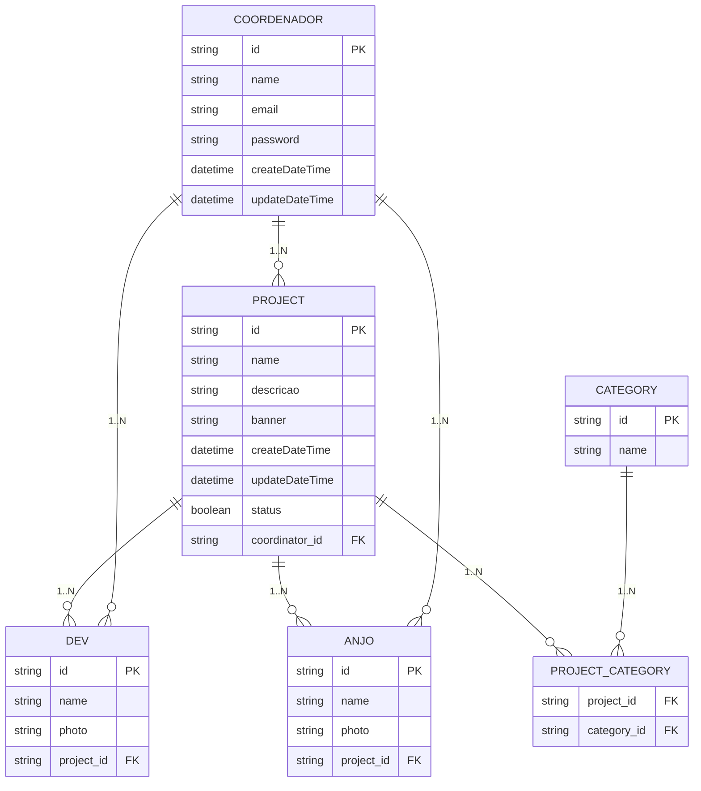

Idealização Banco de dados 

```mermaid
erDiagram
    COORDENADOR {
        string id PK
        string name
        string email
        string password
        datetime createDateTime
        datetime updateDateTime
    }

    PROJECT {
        string id PK
        string name
        string descricao
        string banner
        datetime createDateTime
        datetime updateDateTime
        boolean status
        string coordinator_id FK
    }

    DEV {
        string id PK
        string name
        string photo
        string project_id FK
    }

    ANJO {
        string id PK
        string name
        string photo
        string project_id FK
    }

    CATEGORY {
        string id PK
        string name
    }

    PROJECT_CATEGORY {
        string project_id FK
        string category_id FK
    }

    COORDENADOR ||--o{ PROJECT: "1..N"
    PROJECT ||--o{ DEV: "1..N"
    PROJECT ||--o{ ANJO: "1..N"
    PROJECT ||--o{ PROJECT_CATEGORY: "1..N"
    CATEGORY ||--o{ PROJECT_CATEGORY: "1..N"
    COORDENADOR ||--o{ DEV: "1..N"
    COORDENADOR ||--o{ ANJO: "1..N"
```
